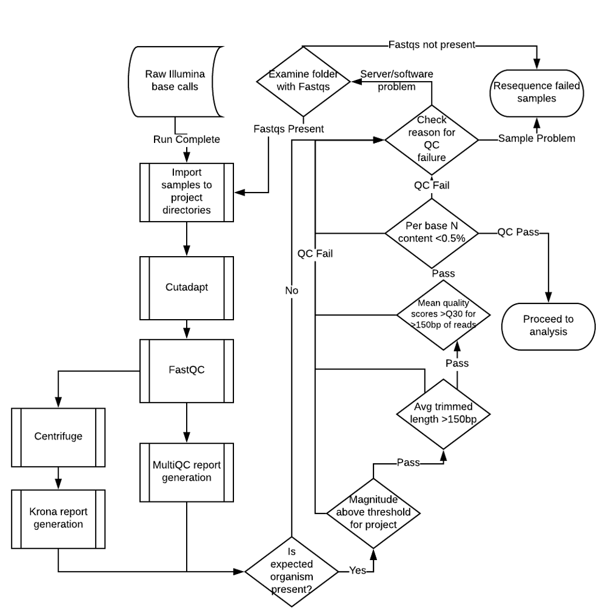
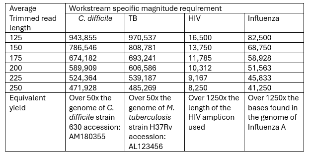

*Example content from a bioinformatics SOP outlining the procedure for assessing the quality of Illumina sequencing data prior to downstream bioinformatics analyses.*

.. raw:: html 
    
    

**Appendices**

**Appendix 1**

Graphical overview of the QC process and key decision points.

**Appendix 2**

Workstream specific minimum magnitude thresholds.

