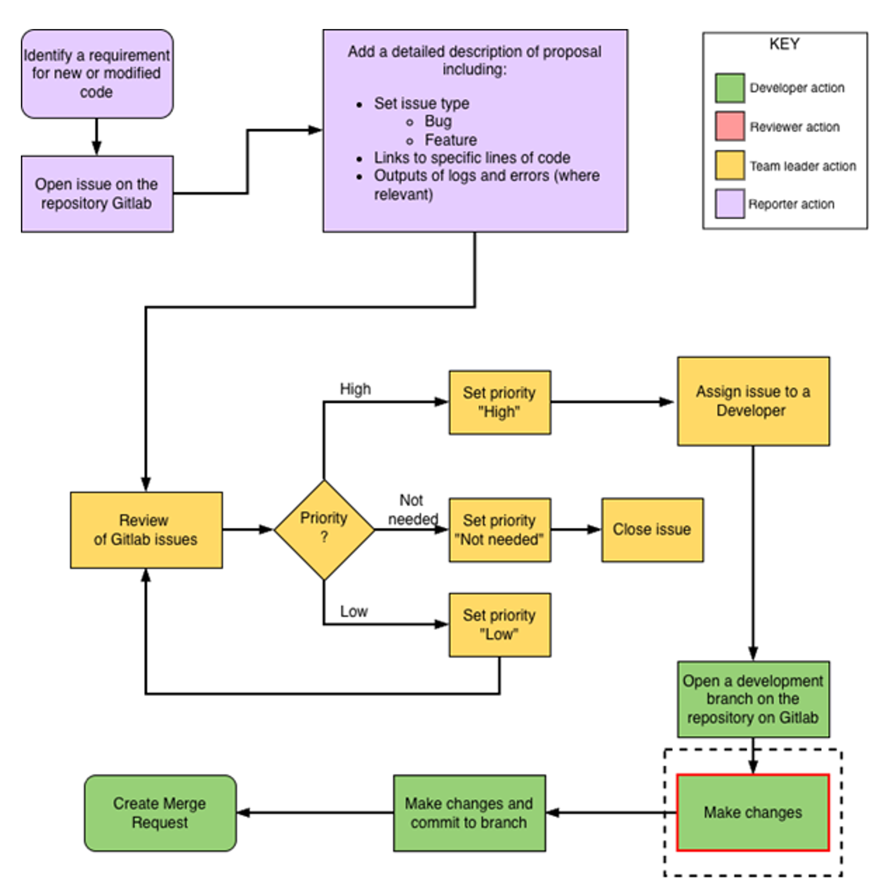
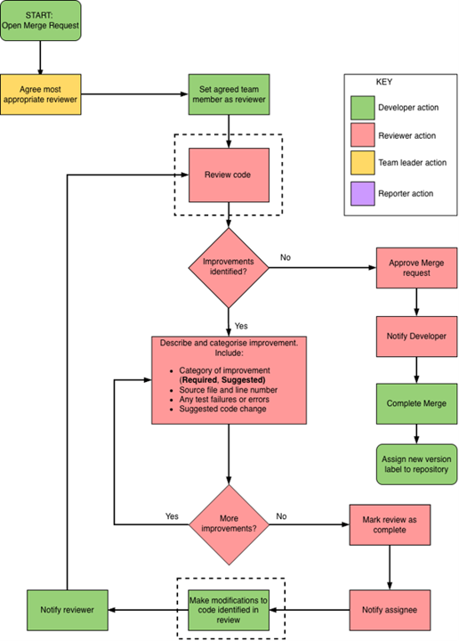

.. _procedure_code_review:

*Example content from an SOP outlining the procedure for updating and reviewing code within the Luma Genomics Unit (LGU).*

.. raw:: html

   

**Procedure**

**1. Overview of the Procedure**

An overview of the procedure is given in the two schematics below. The actions surrounded by a dotted boxed line involve writing and reviewing code, and should be done with reference to the guidelines and supporting documents laid out in Appendix 1.

*Schematic 1:* Process by which requirements for new or modified code are raised and reviewed

*Schematic 2: Process by which code changes are made, reviewed and approved*

.. raw:: html

   

**2. Roles and Actions**

Actions in the process are performed by roles. One person may assume different roles at different stages of the process subject to constraints.

.. list-table::
   :header-rows: 1

   * - Role
     - Team members who can assume roles
     - Responsibilities
   * - Reporter
     - Anyone
     - - Identify requirement for new/changed code
       - Open a GitLab issue
       - Describe the requirement in detail
   * - Developer
     - Anyone, but Developer and Reviewer must be different people for an issue
     - - Open development branch on VCS
       - Make changes to code, test, and commit to branch
       - Create merge request on branch
       - Assign agreed reviewer to review merge request
       - Make changes identified by review and commit them to branch
       - Notify reviewer of completion of work
       - (On approval) complete the merge
       - Assign new version/tag to repository
   * - Reviewer
     - Anyone, but Developer and Reviewer must be different people for an issue
     - - Review merge request according to coding standards and guidelines (see Section 1)
       - Describe and categorise proposed improvements to code
       - (When no more improvements to suggest) approve merge request
       - Notify Developer of outcome of review
   * - Team leader
     - Team leader (Lead developer in their absence)
     - - Review outstanding issues on VCS, assigning priority
       - Assign Developers to high‑priority issues
       - Close issues that are low priority or not needed
       - Assign reviewers to open merge requests

.. raw:: html

   

**3. Classifying Reviewer Improvement Requests**

During code review, reviewers should comment on the places where code can be improved, and distinguish between the required and suggested improvements. Those that are specified as required improvements will need to be implemented as a post-review action before the code can be merged; suggested improvements can be made at a later stage as they describe ‘good practice’ rather than functional changes.

To distinguish between required and suggested changes, the reviewer should begin review comments with a code, as described in the following table.

.. list-table::
   :header-rows: 1
   :widths: 20 80

   * - Type of Improvement
     - Code Examples
   * - Required (R)
     - - Variables are incorrectly set
       - The logic of the code is incorrect — the program will not behave as expected
       - Errors may be thrown which will not be appropriately handled or where the cause may not be obvious to the user
       - Incorrect naming of variables, functions, classes, etc.
       - Insufficient or unclear comments
       - Violation of style guidelines
       - Potentially large efficiency or readability improvements to the code (including use of libraries, packages, frameworks, etc.)
   * - Suggestion (S)
     - - Future improvements which do not add essential functionality relevant to this update
       - Unused code which has been commented out or is in uncalled functions but is not impacting readability
       - Reuse/duplication of the same small chunks of code
       - Minor spelling error
       - Suggestions for use of libraries, frameworks, packages, etc. which will not dramatically improve readability or performance
       - Refactoring suggestions which will improve readability or style where the code is already sufficiently readable
       - Future improvements which are not relevant to this update

.. raw:: html

   

**4. Use of GitLab in the process**

The version control system (VCS) used at LMU to implement this process is GitLab. Here we describe in detail how the roles in the process interact with GitLab to perform the actions.

**4.1 GitLab Issue Fields: Issue Types and Priorities**

GitLab issue fields are used to categorise issues and form an important part of the review process. The fields/values used at LGU are as follows:

.. list-table::
   :header-rows: 1
   :widths: 20 20 60

   * - Field
     - Value
     - Definition
   * - Issue Type
     - Bug
     - A problem affecting how code works
   * - Issue Type
     - Feature
     - A suggestion for an improvement
   * - Priority
     - High
     - An issue that needs to be worked on immediately
   * - Priority
     - Low
     - An issue that needs to be addressed, but is non‑urgent and not scheduled immediately
   * - Priority
     - Not needed
     - An issue that is not needed

**4.2 Developer Tasks**

1. Login to GitLab (in web-browser).

2. In GitLab, navigate to the required repository.

3. Using the command line, clone the GitLab repository or individual branch.  

   First, copy the repository URL using the clone dropdown on the *Project overview* page on the GitLab website, then change directory into the location you want to store the code and type one of the following commands depending on your requirements:

   .. code-block:: bash

      git clone <remote-repo-url>
      git clone --branch <branchname> <remote-repo-url>

4. Create a new development branch:

   .. code-block:: bash

      git checkout -b <branchname>

5. Edit the code, ensuring that guidelines referred to in Appendix 14.1 (and supporting documents) are adhered to.

6. Test the changes using the appropriate data and environment.

7. Stage the edited files for commit to the branch:

   .. code-block:: bash

      git add <edited_file_name>

8. Commit the changes to the local repository branch:

   .. code-block:: bash

      git commit -m "[basic message describing code changes]"

   When writing a git commit message:

   - Limit the subject line to 50 characters
   - Capitalise the subject line
   - Use the imperative mood in the subject line (e.g. "Remove deprecated methods" rather than "Removed deprecated methods")

9. Push the changes to the remote repository:

   .. code-block:: bash

      git push -u origin <branch_name>

10. Go to the GitLab website to submit a merge request between the edited branch and the main version.

    - Select the source and target branches

      - Source: updated (and tested) code branch
      - Target: master branch

    - Click *Compare branches + continue*

    - Fill in the title for the change

    - Add the content of the GitLab Merge Request template from Appendix 14.2.1 to the description

    - Set yourself as the Assignee

    - Once a Reviewer has been agreed, assign them to the merge request under *Reviewer*

    - Edit the Merge Request description text, replacing or removing template text as appropriate
    
    - Click *Submit merge request*

11. Any line-by-line and general comments made on previous commits will be displayed on the merge request page.

12. Any further general comments should be made on the merge request page within the relevant section of the review checklist template by selecting the check-boxes or clicking *Edit*.

13. Any further line-by-line comments can be made by clicking on *Changes* and adding insightful comments, or by clicking on *Commits* and adding them to the relevant commit.

14. Notify the Reviewer of the merge request. Link the Reviewer to the merge request for review.

15. Once the Reviewer has reviewed the code, they will inform you of any additional comments and changes required. This may take the form of multiple rounds of review, changes, and testing.

16. Once these actions have been resolved and the Reviewer has agreed that the branch is ready to merge into master, they will tick *Approve* and inform you.

17. Complete the merge by clicking *Merge*.

18. Finally, assign a new version to the master branch (which now incorporates the changes).

**4.3 Reviewer Tasks**

1. The code Reviewer will be notified of a new merge request to review by the Developer.

2. Log in to GitLab.

3. Click on *Merge requests* in the left-hand sidebar.

4. Click on *Assigned to you*.

5. Click on the relevant branch name of the merge request.

6. Assess the request and confirm you are competent to review; notify the Team Leader if you feel you do not have the knowledge/skills for this review.

7. Pull the updated development code from GitLab and run any tests as agreed.  

   Follow the steps outlined in steps 3–5 of the Developer tasks above to clone the repository or branch.

   If the repository or branch is already cloned in a suitable testing location, checkout into the latest/finalised version of the working branch:

   .. code-block:: bash

      git checkout <name_of_branch_for_review>

8. Review the code highlighting improvements according to LGU guidelines and standards (see Appendix 14.1 and supporting documents).

   If you find an improvement that relates to specific lines of code, add a GitLab comment to the related lines in the *Changes* tab of the merge request.

   Start the comment with ([Type][Index]) e.g. for the third required improvement found:

   ::

      (R3) This code is unreadable …

   If you are making several comments at once, use the *Start a review* button to group comments with a final post.

   When you have completed your review, populate the end-of-review comment using the GitLab Merge Request – Reviewer template (Appendix 14.2.2), and notify the Developer of the completion of the review.

   The Developer will address improvements by pushing new changes to the code and commenting on the improvement raised.

   You may need to repeat multiple rounds of review going back and forth between Reviewer and Assignee. In each round continue numbering the code improvements from where the last round ended. For example, a second round of review might start with a new required improvement R15.

**Testing as part of Review**

9. The Reviewer is responsible for reviewing test results, suggesting missing tests for the Developer to satisfy, and running tests if agreed.

   These may take the form of:

   - A testing suite

   - Suggested tests provided by the Developer

   - Tests chosen by the Reviewer that they deem appropriate to assure the quality of the code

   - Tests in an environment appropriately similar to that of the production environment to confirm updated code is functioning as expected prior to code review request.

10. Review the checklist comments on the merge request *Merge Request Assignee Overview*.

11. If the code passes code quality assurance and operational testing, state in the checklist comment box that the code was reviewed, and where appropriate tested and worked as expected. Complete all reviewer sections of the template.

    Click *Approve* the merge and inform the Assignee on Slack who will complete the merge.

12. If the code fails operational testing, in the appropriate section of the merge review comment, write:

    ::

       (R#) - When testing the code, the following error occurred: <the error message>

    Testing failures always result in required changes. You may provide information on what has caused the error and a possible solution if you are able to identify these easily.

13. Notify the Developer so they can correct, test, and commit their code. Another review cycle will then start.

