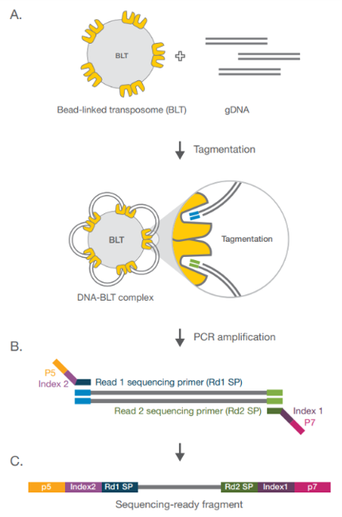

*Example content from a wet-lab SOP outlining the procedure for preparing sequencing libraries using the Illumina DNA Prep kit.*

.. raw:: html 
    
    

**Underlying Principles**

The Illumina DNA Prep Library Preparation Kit uses Bead-Linked Transposome Chemistry. Upon addition of genomic DNA to the Bead-Linked Transposomes (BLT) DNA-BLT complexes form whereby the BLT mediates the simultaneous fragmentation and addition of Illumina adapters. After the bead-bound transposomes become saturated with DNA no additional tagmentation can occur. This saturation-based normalisation process provides flexibility to use a wide DNA input range to generate normalised libraries of consistent tight fragment size distribution. Following tagmentation, a limited-cycle PCR then amplifies the DNA fragments, adding indexes and adapters for sequencing to the ends of each fragment.

Figure 1. Illustration of Illumina on-bead transposome chemistry - (A) Bead-linked transposomes mediate the simultaneous fragmentation of gDNA and the addition of Illumina sequencing primers; (B) Reduced-cycle PCR amplifies sequencing ready DNA fragments and adds indexes and adapters; (C) Sequencing-read fragments are washed and pooled. Image source: Illumina.

