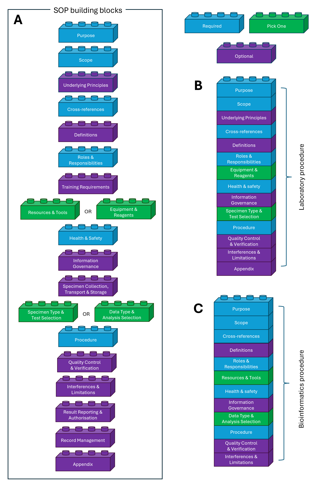

SOP Writing Guidelines
======================

Introduction
------------

:ref:`Standard Operating Procedures (SOPs) <standard_operating_procedure_sop>` are detailed, written instructions that describe how to perform specific tasks or processes consistently and correctly. SOPs are essential for ensuring quality, accuracy, and reproducibility in various settings, particularly in regulated environments such as clinical laboratories. SOPs are a fundamental requirement for accreditation under ISO 15189, which sets out the requirements for quality and competence in medical laboratories.

The use of SOPs in clinical laboratories has traditionally focused on wet-laboratory procedures, where they provide step-by-step guidance for laboratory personnel to follow when performing diagnostic procedures. Examples of such procedures (within a public health context) could include, the culture and identification of *Mycobacterium tuberculosis* (TB) or the detection of HIV using serological assays. As such the evolution of SOPs has historically been closely tied to physical laboratory workflows. However, as genomics becomes an ever more integral part of disease diagnostics and pathogen surveillance, there is an increasing need for SOPs tailored specifically to bioinformatics pipelines. 

Unlike laboratory SOPs, which focus on physical procedures and equipment, bioinformatics SOPs must describe digital workflows, computational tools, data management processes, and software dependencies. Consequently existing SOP structures and formats designed for wet-lab procedures may not be fully appropriate for documenting bioinformatics workflows. Existing SOP templates are also unsuited to the diverse range of other procedures that may require SOP documentation within a modern clinical laboratory setting. For example, SOPs may be needed to document staff training procedures, code update and review processes for software, or verification and validation protocols for new analytical methods or examinations.

----------------

Defining a universal SOP template?
--------------------------------

Defining a single SOP structure that will work well for all possible applications within a clinical laboratory can be challenging, as SOPs detailing wet-lab procedures will have very different requirements and content compared to those describing bioinformatics workflows, training procedures, verification and validation processes, or the miriad of other processes that may require SOP documentation. Likewise, defining a universal SOP template that fits all organisations is impractical due to variations in organisational structure, regulatory environments, and specific operational needs. 

Creating a one-size-fits-all SOP template would therefore lead to sections that are irrelevant or redundant for certain types of procedures, making the SOP cumbersome and difficult to use.

----------------

A modular alternative to SOP writing
------------------------------------

To overcome these challenges, we propose a modular approach to SOP writing. This approach recognises that while certain sections are universally applicable across most SOPs (e.g., Purpose, Scope, Responsibilities), other sections may only be relevant for specific types of procedures (e.g., Data Types for bioinformatics pipelines, Sample Preparation for laboratory protocols). 

The following diagram illustrates the modular structure of SOPs using this approach:

Each building block in the diagram represents a distinct section of an SOP. Some sections are fundamental and should be included in all SOPs, while others are optional and can be included based on the specific requirements of the procedure being documented.

Using these building blocks, organisations can tailor the SOP structure to suit the specific needs of each procedure while maintaining consistency in format and style across all SOPs. Users of our approach will need to select building block sections that are relevant to the procedure being documented. This provides for flexibility and adaptability, allowing organisations to create SOPs that are better fit for purpose.

----------------

SOP building block guidance & examples
--------------------------------------

On the basis of the modular SOP structure outlined above, we have developed detailed writing guidance for each building block section. Each section includes:

- A description of the section's purpose and importance.

- Guidance on what content to include.

- Example content for different types of procedures (e.g., bioinformatics pipelines, laboratory procedures, training protocols) as appropriate.

Each section of the SOP writing guidance can be accessed via the table of contents below or by navigating using the "Next" and "Previous" buttons at the bottom of this page.

.. toctree::
   :maxdepth: 2

   sop_guide_purpose
   sop_guide_scope
   sop_guide_cross_references
   sop_guide_responsibilities
   sop_guide_definitions
   sop_guide_resources
   sop_guide_health_safety_information_governance
   sop_guide_data_types
   sop_guide_procedure
   sop_guide_quality_control_assurance
   sop_guide_interference_limitations
   sop_guide_results_reporting
   sop_guide_authorisation
   sop_guide_appendices
   sop_guide_change_history

Throughout the guidance we have focussed on five procedure case studies to illustrate how the modular SOP structure can be applied in practice:

.. dropdown:: 🧬 Bioinformatics Procedure

   This SOP covers the bioinformatics analysis of HIV genomic data for antiviral resistance prediction...

.. dropdown:: 🧪 Laboratory Procedure

   A wet-lab SOP covering sample preparation, reagent handling, and equipment calibration.

.. dropdown:: 👩‍🔬 Staff Training Procedure

   A training SOP for onboarding and certifying laboratory personnel in core workflows.

.. dropdown:: 💻 Code Update & Review Procedure

   A software SOP for managing code changes, peer review, and version control in bioinformatics tools.

.. dropdown:: ✅ Verification Procedure

   Add description

.. raw:: html

   